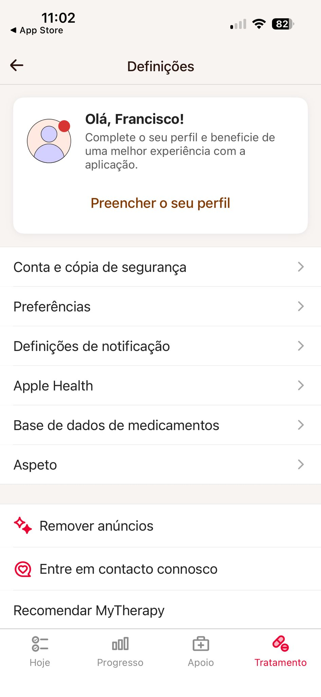
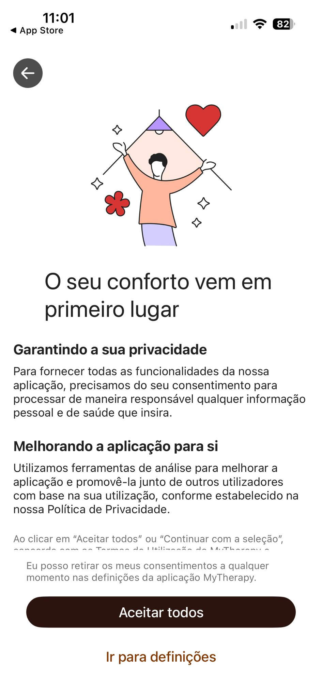
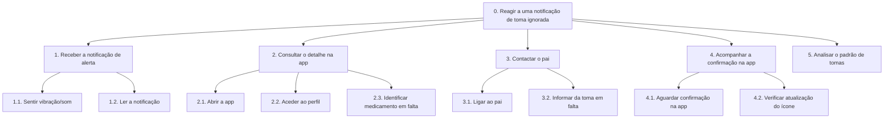
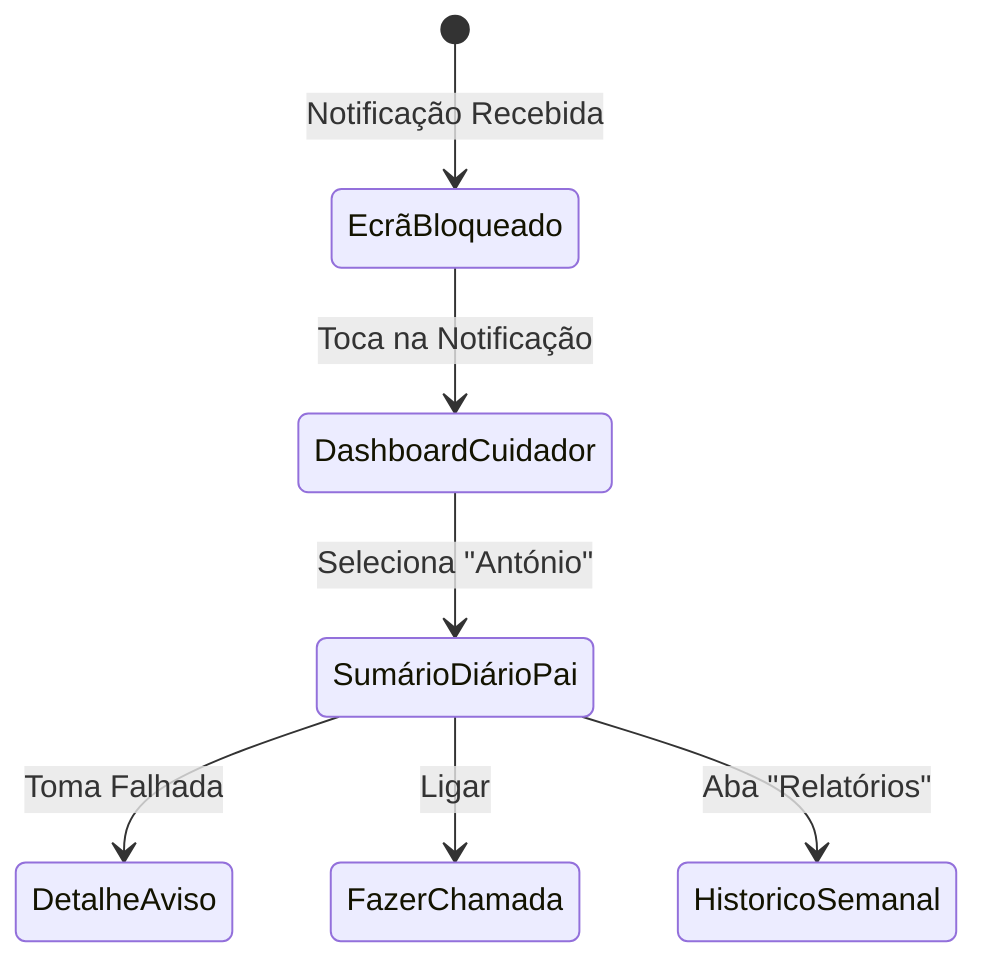

# Relatório Individual - Francisco Soudo (14060)

UC: Interação Pessoa-Computador · TG1 · Equipa 14
Ano Letivo: 2025/2026 · IPBeja / ESTIG

---

## 1. Introdução e Resumo de Tarefas

Este relatório documenta a contribuição individual de Francisco Soudo (14060) para o projeto **EasyMed**. O trabalho incidiu sobre a análise de sistemas semelhantes, definição de persona e cenário de cuidador, análise de tarefas hierárquica, definição de princípios de usabilidade e prototipagem do fluxo de monitorização remota.

---

## 2. Análise de Sistema Semelhante: MyTherapy

O MyTherapy é uma aplicação móvel focada na gestão abrangente da medicação e manutenção da saúde do utilizador, disponível para Android e iOS.

### Descrição Geral
A aplicação vai além dos simples lembretes de medicação ao permitir registar sintomas diários, aferir parâmetros essenciais de saúde (como a pressão arterial, ritmo cardíaco, glicemia e peso) e construir um histórico pessoal. Uma das suas valências mais fortes é a capacidade de compilar estes dados em relatórios práticos para partilhar com profissionais de saúde. Adicionalmente, possui uma forte componente social ao permitir a inclusão de familiares ou profissionais de saúde no acompanhamento do doente.

### Interface e Design
A interface apoia-se num design "limpo" (clean), predominantemente com fundo branco e acentos em azul claro, transmitindo uma sensação de ambiente clínico, organizado e seguro. O ecrã principal funciona como uma *To-Do List* (agenda diária). Beneficia de uma navegação simples baseada numa barra inferior (Bottom Navigation Bar) com ícones intuitivos. A tipografia de grandes dimensões e os botões largos evidenciam um cuidado especial com a acessibilidade.

### Funcionalidades Principais
- **Lembretes de medicação avançados**: permitem configuração de dosagens e confirmação de toma segura.
- **Inventário de medicamentos**: controlo das embalagens com alertas de reposição.
- **Registo holístico de saúde**: registo de humor, sintomas e bem-estar geral.
- **Monitorização paramétrica**: gravação de tensão arterial, peso, sono e glicemia.
- **Geração e exportação de relatórios**: criação de documentos em PDF para análise médica.
- **Modo familiar/equipa (Team)**: permite a familiares acompanharem a adesão à medicação.

### Pontos Positivos e Negativos
**Positivos:**
1. Design acessível e minimizador do esforço cognitivo.
2. Confirmação de toma à prova de erro (exige ação intencional).
3. Agenda visual e cronológica clara.
4. Sistema de "Gamificação" que incentiva a adesão.

**Negativos:**
1. Risco de sobrecarga funcional para utilizadores que procuram apenas o básico.
2. Processo de inserção de medicamentos extenso e aborrecido.
3. Escassez de distinção visual nas notificações no ecrã bloqueado.

### Capturas de Ecrã (MyTherapy)

---

## 3. Persona: Carla Sousa (Cuidadora)

A **Carla Sousa** representa o perfil do cuidador familiar com formação na área da saúde — um utilizador secundário crucial na EasyMed.

- **Idade:** 46 anos
- **Profissão:** Enfermeira
- **Localização:** Beja
- **Contexto:** O pai da Carla (António, 74 anos) toma 5 medicamentos diários após um AVC. A Carla monitoriza remotamente a adesão do pai através da EasyMed.

### Objetivos
- Monitorizar remotamente a adesão ao plano de medicação do pai.
- Ser notificada rapidamente quando o pai falha uma toma.
- Ter acesso ao histórico de tomas para mostrar ao médico.

### Frustrações
- Apps que não permitem gerir a medicação de outra pessoa de forma simples.
- Ter de ligar constantemente ao pai para saber se tomou os medicamentos.

---

## 4. Cenário de Utilização: Notificação de Toma Ignorada

### Narrativa
É uma tarde de terça-feira e a Carla está no hospital a terminar o seu turno. O telemóvel vibra — é uma notificação da EasyMed: *"O António não confirmou a toma de Sinvastatina 20mg. A toma está com 30 minutos de atraso."*

A Carla abre a app e vê o perfil do pai com um ícone a vermelho junto ao medicamento em falta. Decide ligar ao pai, que explica ter adormecido e não ter ouvido o alarme. A Carla instrui-o a tomar o comprimido de imediato. Momentos depois, a Carla vê na app que o ícone mudou de vermelho para amarelo (toma efetuada com atraso). Ela verifica o resumo semanal e nota que esta é a segunda falha à tarde, decidindo falar com o médico sobre o horário desse medicamento.

---

## 5. Análise de Tarefas (HTA)

### Decomposição Hierárquica
0. **Reagir a uma notificação de toma ignorada**
   1. Receber a notificação de alerta
   2. Consultar o detalhe na app
   3. Contactar o pai
   4. Acompanhar a confirmação na app
   5. Analisar o padrão de tomas (opcional)

### Diagrama HTA

---

## 6. Princípios de Usabilidade Aplicados

Com base na análise do MyTherapy e nas necessidades da Persona Carla, foram definidos 4 princípios fundamentais:

1. **Visibilidade do Estado do Sistema**: Uso de código de cores imediato (Verde: Tomado, Vermelho: Ignorado, Amarelo: Atraso).
2. **Prevenção de Erros**: Botões de confirmação que exigem intenção extra (swipe) para evitar o "Fat-Finger error".
3. **Correspondência com o Mundo Real**: Histórico listado por cronologia de horário, semelhante a um calendário físico.
4. **Estética e Design Minimalista**: Ecrã de notificação limpo, focado apenas na ação urgente: "Ligar ao Paciente".

---

## 7. Protótipo e Navegação

### Diagrama de Navegação

### Ecrãs do Protótipo (Cenário 2)

| Ecrã | Função | Imagem |
|------|--------|--------|
| **F1** | Notificação no ecrã bloqueado |  |
| **F2** | Dashboard do Cuidador |  |
| **F3** | Detalhe das Tomas do Familiar |  |
| **F4** | Histórico Semanal / Relatórios |  |

---

## 8. Organização do Trabalho e Utilização de IA

O trabalho foi gerido via **Trello** seguindo a metodologia **Scrum**. A comunicação foi mantida via WhatsApp para garantir a coerência com o trabalho do colega Miguel Pauzinho.

A Inteligência Artificial (**Claude**) foi utilizada como ferramenta de apoio para a geração inicial de narrativas de cenários, estruturas de HTA e redação de justificações técnicas, tendo todo o conteúdo sido revisto, validado e adaptado por mim para garantir a qualidade e fidelidade aos requisitos do projeto.

---

## 9. Reflexão Final

O desenvolvimento deste projeto permitiu compreender a importância crítica do utilizador secundário (cuidador). A análise do MyTherapy revelou que o excesso de funcionalidades pode ser prejudicial, orientando o design da EasyMed para a simplicidade e eficácia nos momentos de urgência. A colaboração em equipa garantiu uma experiência de utilizador consistente entre os diferentes perfis de utente e cuidador.
